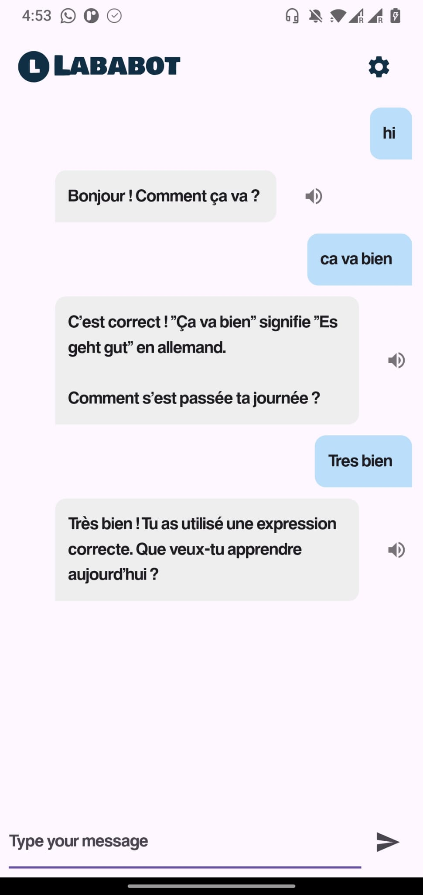

# LabaBot

An interactive chat application that integrates voice recording and transcription. The app offers an intuitive user interface and uses the OpenAI API for speech transcription and intelligent conversations. Perfect for language learning or general chatting purposes.

## Main Page Overview

The main chat page includes the following features:

1. **Chat Messages**: Displays a list of sent and received messages.
2. **Input Field**: Allows users to type their messages and send them.
3. **Voice Recorder**: Press and hold the microphone icon to record your voice, which will be transcribed and sent as a message.
4. **Settings Button**: Navigate to the settings page to configure preferences like language selection.



## Adding Your API Key

To use the application, you need to add your own OpenAI API key. Follow these steps:

1. Create a file named `.env` in the root directory of the project.
2. Open the `.env` file and add the following line:

   ```env
   OPENAI_API_KEY=your_openai_api_key
   ```

   Replace `your_openai_api_key` with your actual OpenAI API key.

3. Save the file.

